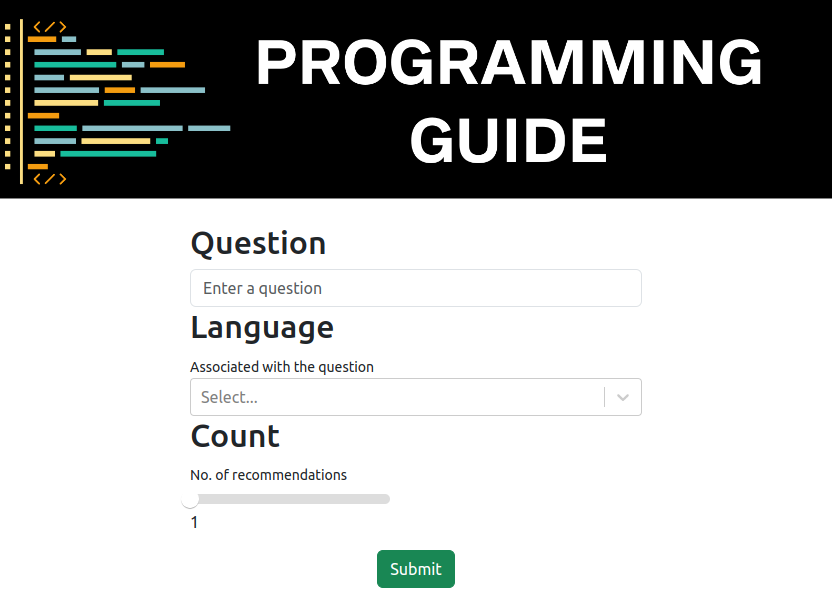
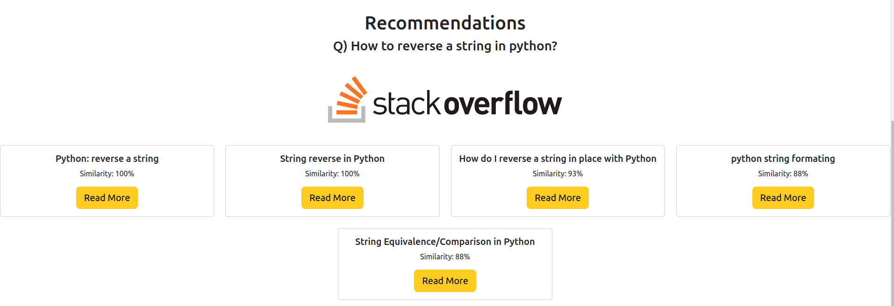
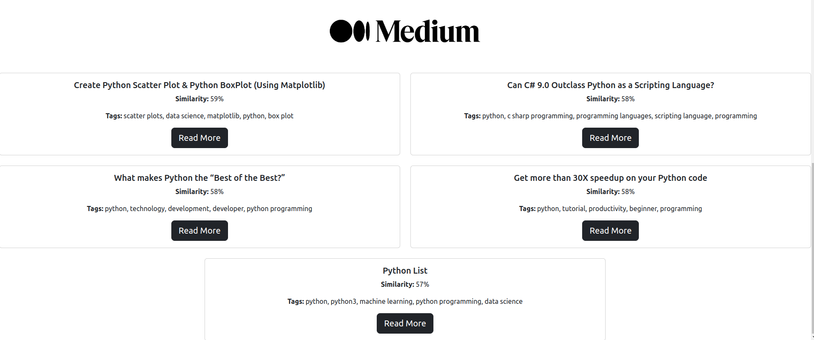

  <p align="center">
    <h1>Programming Guide</h1>
  </p>

  <h2>Table of Contents</h2>
  <ol>
    <li>
      <a href="#about-the-project">About The Project</a>
      <ul>
        <li><a href="#built-with">Built With</a></li>
      </ul>
    </li>
    <li>
      <a href="#getting-started">Getting Started</a>
      <ul>
        <li><a href="#prerequisites">Prerequisites</a></li>
        <li><a href="#installation">Installation</a></li>
      </ul>
    </li>
    <li><a href="#usage">Usage</a></li>
    <li><a href="#roadmap">Roadmap</a></li>
    <li><a href="#contributing">Contributing</a></li>
    <li><a href="#license">License</a></li>
    <li><a href="#contact">Contact</a></li>
    <li><a href="#acknowledgments">Acknowledgments</a></li>
  </ol>

<!-- ABOUT THE PROJECT -->
## About The Project

This is a project that aims to provide you with answers for your programming questions by finding and displaying similar questions from stackoverflow and any similar articles from medium.

It uses stackoverflow data as well as medium articles data available on kaggle for the recommendations.

The sentences are embedded using GloVe embeddings, data is filtered on the basis of tags provided and then cosine similarity is used to get top n most similar stackoverflow questions and medium articles.

### Flow
question -> pre-processed -> embeddings -> filtered data using tag -> similarity score -> display top n results

<p align="right">(<a href="#readme-top">back to top</a>)</p>

### Built With

- **Frontend**: ReactJS
- **Backend**: FastAPI
- **Model**: GloVe + Cosine Similarity
- **Web Server**: Nginx

### Data Source
Both the datasets were sourced from kaggle.
- **Stackoverflow**: [StackSample: 10% of Stack Overflow Q&A](https://www.kaggle.com/datasets/stackoverflow/stacksample)
- **Medium**: [190k+ Medium Articles](https://www.kaggle.com/datasets/fabiochiusano/medium-articles)

<p align="right">(<a href="#readme-top">back to top</a>)</p>

### Project Structure
```
├── backend/
│   ├── model/
│   │   ├── config.py
│   │   ├── model.py
│   │   └── preprocess.py
│   ├── server/
│   │   └── api.py
│   ├── .dockerignore
│   ├── .gitignore
│   ├── Dockerfile
│   └── requirements.txt
├── client/
│   ├── nginx/
│   │   ├── default.conf
│   │   └── Dockerfile
│   ├── node_modules
│   ├── public
│   ├── src
│   ├── .dockerignore
│   ├── .gitignore
│   ├── Dockerfile
│   ├── package-lock.json
│   └── package.json
├── nginx/
│   ├── default.conf
│   └── Dockerfile
├── src/
│   ├── app.png
│   ├── banner.png
│   ├── medium_demo.png
│   └── stackoverflow_demo.png
├── .gitignore
├── docker-compose.yml
└── README.md
```

## Getting Started

The project is dockerized and makes use of docker compose. Therefore the only thing that you need in order to run the project is docker.

### Prerequisites

* Docker: [how to install docker](https://docs.docker.com/get-docker/)
  
### Installation

1. Get kaggle API key. [How to get kaggle API key?](https://christianjmills.com/posts/kaggle-obtain-api-key-tutorial/)
   
2. Store kaggle API credentials as an .env file in the root directory. It should be in the following format
    ```
    KAGGLE_USERNAME = your_kaggle_username
    KAGGLE_KEY = your_api_key
    ```
3. Run docker compose in the root directory.
   ```sh
   docker compose up
   ```

The project should be up when you visit localhost

<p align="right">(<a href="#readme-top">back to top</a>)</p>

## Usage

### App
<div style="display: flex; justify-content: center;">
  
</div>
<hr>

**Question**: Any programming question.

**Language**: Programming language associated with the question.

**Count**: Number of recommendations to get each for stackoverflow and medium.

<hr>

### Output

#### Stackoverflow
<div style="display: flex; justify-content: center;">
  
</div>
<hr>

#### Medium
<div style="display: flex; justify-content: center;">
  
</div>
<hr>

<p align="right">(<a href="#readme-top">back to top</a>)</p

<!-- ACKNOWLEDGMENTS -->
## Acknowledgments

Use this space to list resources you find helpful and would like to give credit to. I've included a few of my favorites to kick things off!

* [Choose an Open Source License](https://choosealicense.com)
* [GitHub Emoji Cheat Sheet](https://www.webpagefx.com/tools/emoji-cheat-sheet)
* [Malven's Flexbox Cheatsheet](https://flexbox.malven.co/)
* [Malven's Grid Cheatsheet](https://grid.malven.co/)
* [Img Shields](https://shields.io)
* [GitHub Pages](https://pages.github.com)
* [Font Awesome](https://fontawesome.com)
* [React Icons](https://react-icons.github.io/react-icons/search)

<p align="right">(<a href="#readme-top">back to top</a>)</p>